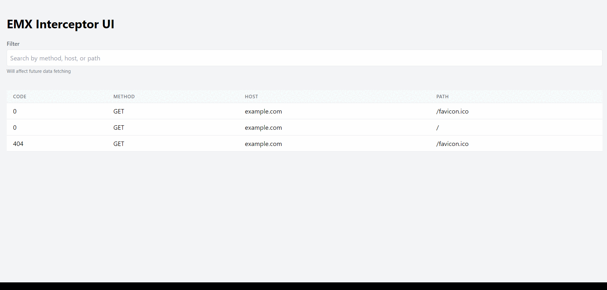

# emx

[](https://github.com/eminmuhammadi/emx/actions/workflows/github-code-scanning/codeql)
[](https://github.com/eminmuhammadi/emx/actions/workflows/dependabot/dependabot-updates)
[](https://github.com/eminmuhammadi/emx/actions/workflows/ci.yml)
[](https://app.fossa.com/projects/git%2Bgithub.com%2Feminmuhammadi%2Femx?ref=badge_shield&issueType=security)

**emx** is a real-time proxy interceptor designed to support both the application layer and database interactions.



```sql
SELECT req.method,
       res.status_code,
       req.host,
       req.request_uri,
       req.body,
       res.body
FROM requests req,
     responses res
WHERE req.session_id = res.session_id
ORDER BY req.created_at DESC;
```

### Features

- GET /api/v1/log
- GET /api/v1/log/:id
- GET /api/v1/request/:id
- GET /api/v1/response/:id

## Installation

You can download binary files for each platform from [the latest releases](https://github.com/eminmuhammadi/emx/releases).

Example on darwin:

```sh
curl -o emx.tar.gz -L https://github.com/eminmuhammadi/emx/releases/download/v1.0.0/emx_1.0.0_darwin_amd64.tar.gz
```

```sh
tar -xf emx.tar.gz && chmod +x ./emx && sudo mv ./emx /usr/local/bin
```

For more details, go to [Start](?tab=readme-ov-file#start) to solve environment variables issues.

## Build

### Prerequisites

- **Go**: Install from [go.dev](https://go.dev/doc/install)
- **OpenSSL**: Binaries available [here](https://wiki.openssl.org/index.php/Binaries)

### Build and Install

```sh
go build -o ./emx . && mv emx /usr/local/bin
```

## Usage

### Configuration

Before starting **emx**, configure the following environment variables:

```sh
export PROXY_HOST=0.0.0.0
export PROXY_PORT=8080
export APP_HOST=127.0.0.1
export APP_PORT=8888
export PROXY_DECRYPT_CERT_FILE=_certs/ca.crt
export PROXY_DECRYPT_KEY_FILE=_certs/ca.key
export TLS_MODE=off
export SQLITE_DSN=:memory:?cache=shared
```

- **TLS_MODE**: Required for the application; the proxy server decrypts HTTPS using `PROXY_DECRYPT_CERT_FILE` and `PROXY_DECRYPT_KEY_FILE`.

### Start

Run **emx**:

```sh
emx
```

or rebuilt and run it using:

```sh
chmod +x ./bin && ./bin
```

Visit [http://127.0.0.1:8888/ui](http://127.0.0.1:8888/ui) to view proxy logs.

### Environment Variables

- **TLS_MODE**: (`off`, `tls`, `mutual_tls`) - required
- **TLS_CERT_FILE**, **TLS_KEY_FILE**, **TLS_CA_FILE**: Optional paths for TLS configurations
- **PROXY_HOST**, **PROXY_PORT**: Required for proxy setup
- **PROXY_DECRYPT_CERT_FILE**, **PROXY_DECRYPT_KEY_FILE**: Required for HTTPS decryption
- **PROXY_VERBOSE**, **SQL_VERBOSE**: Optional boolean flags (default: `false`)
- **APP_HOST**, **APP_PORT**: Required for application setup
- **SQLITE_DSN**: Optional SQLite database configuration (default: `:memory:?cache=shared`)
- **MOCK_FILE**: Optional path to YAML file for API mocking

## Mocking

Configure API responses using a YAML file (`mock.yaml`):

```yaml
patterns:
  - method: "GET"
    host: "example.com"
    path: "/"
    response:
      status_code: 200
      headers: |
        Content-Type: application/json
      body: |
        {
          "message": "Hello, World!"
        }

  - method: "GET"
    host: "www.google.com"
    path: "/"
    response:
      status_code: 200
      headers: |
        Content-Type: application/json
      body: |
        {
          "message": "Hello, Google!"
        }
```

```sh
$ curl --proxy 127.0.0.1:8080 --insecure https://example.com
{
  "message": "Hello, World!"
}
```

```sh
$ curl --proxy 127.0.0.1:8080 --insecure https://www.google.com
{
  "message": "Hello, Google!"
}
```

### Intercepting HTTPS

To intercept HTTPS requests, trust the CA cert file (`_certs/ca.crt`). If not generated, run the following command:

```sh
chmod +x ./openssl_gen.sh && ./openssl_gen.sh
```

Distribute `_certs/ca.crt` and follow your device's trust procedures:

- Windows: [Learn more](https://learn.microsoft.com/en-us/windows-hardware/drivers/install/trusted-root-certification-authorities-certificate-store)
- MacOS: [Learn more](https://support.apple.com/en-gb/guide/keychain-access/kyca11871/mac)
- iPhone: [Learn more](https://support.apple.com/en-us/102390)
- Android: [Learn more](https://developer.android.com/privacy-and-security/security-ssl#Pinning)

----

[](https://app.fossa.com/projects/git%2Bgithub.com%2Feminmuhammadi%2Femx?ref=badge_large&issueType=license)
